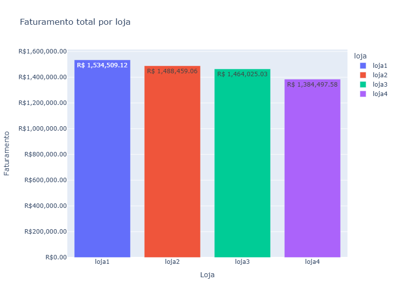
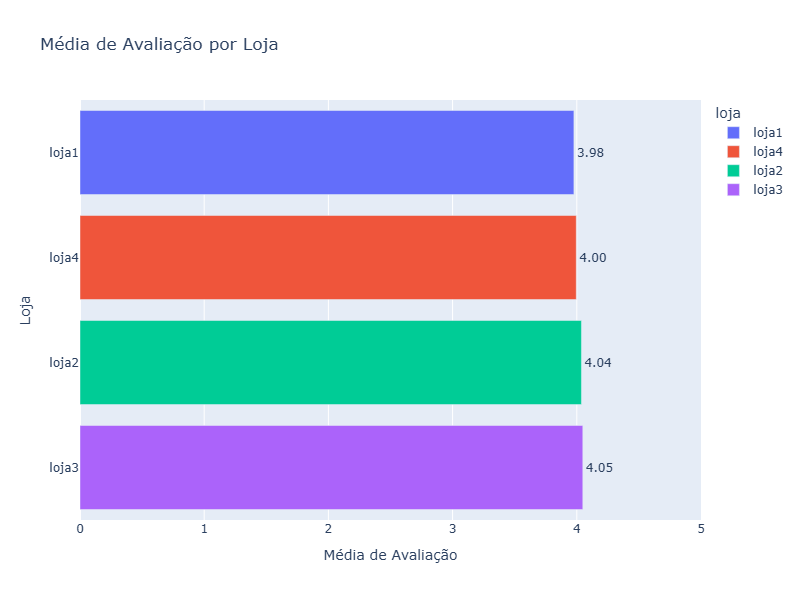
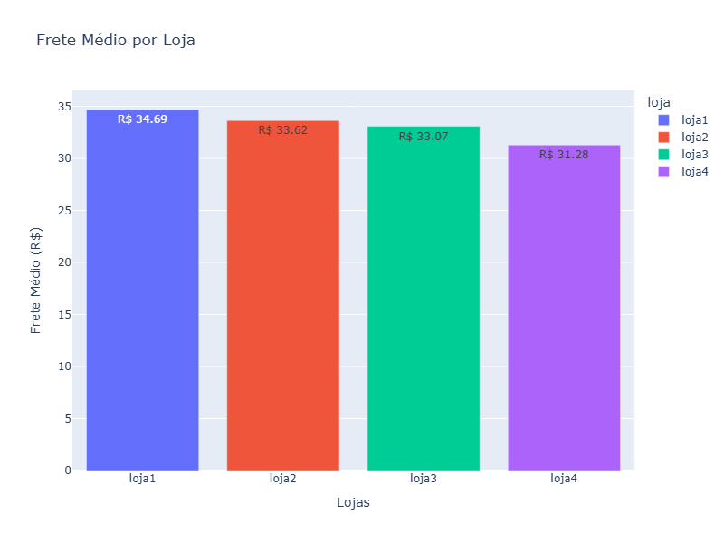

# Alura Store: Análise de Desempenho de Vendas 🛒📊

Bem-vindo ao projeto **Alura Store**, uma análise de dados desenvolvida para auxiliar o **Sr. João** na decisão estratégica de qual das quatro lojas (loja1, loja2, loja3 ou loja4) deve ser vendida para financiar um novo empreendimento. Este README apresenta o propósito da análise, a estrutura do projeto, exemplos de gráficos e insights, além de instruções para executar o notebook `AluraStoreBr.ipynb`. 🚀

---

## Propósito da Análise 🔍

O objetivo do projeto é identificar a loja com menor desempenho e maior necessidade de melhorias, recomendando sua venda com base em dados. A análise utiliza métricas como **média de avaliação**, **produtos mais e menos vendidos**, **frete médio** e **faturamento total** para embasar a decisão do Sr. João, seguindo práticas de tomada de decisão orientada por dados, comuns em grandes empresas e e-commerces. A recomendação final é vender a **loja1**, devido à baixa satisfação do cliente, frete elevado e menor faturamento, liberando recursos para um novo negócio enquanto as lojas mais promissoras são mantidas. 🎯

---

## Estrutura do Projeto e Organização dos Arquivos 📂

O projeto está organizado de forma clara para facilitar o acesso aos arquivos e a reprodução da análise. Abaixo está a estrutura dos diretórios e uma descrição dos arquivos principais:

```
challenge1-data-science/
├── data
├── graficos
├── AluraStoreBr.ipynb
└── requirements.txt
```

- **data**: Contém os dados de vendas, incluindo colunas como loja, produto, preço, frete e avaliação.
- **AluraStoreBr.ipynb**: Notebook Jupyter com o código da análise, incluindo limpeza de dados, cálculos (ex.: faturamento total, frete médio) e visualizações (gráficos de barras).
- **graficos**: Diretório para armazenar gráficos gerados, como o exemplo de faturamento e frete.
- **requirements.txt**: Lista de bibliotecas Python necessárias (ex.: pandas, plotly).
- **README.md**: Documentação do projeto, com instruções e insights.

---

## Exemplos de Gráficos e Insights Obtidos 📈✨

A análise gerou visualizações e insights que destacam o desempenho das lojas. Abaixo estão exemplos de um gráfico e os principais insights extraídos:

### **Gráficos: Faturamento Total, Média Avaliação por Loja e Frete Médio por Loja**
<br>


<br>


<br>


### **Principais Insights** 🌟

1. **Loja1: Candidata à Venda 😕**
   - Menor média de avaliação, indicando baixa satisfação do cliente.
   - Frete médio mais alto (R$ 34,69), comprometendo a competitividade.
   - Menor faturamento (R$ 1,47M), sugerindo menor retorno financeiro.
   - **Insight**: Vender a loja1 libera capital para novos investimentos, evitando custos elevados para corrigir problemas operacionais.

2. **Loja2: Líder em Receita 📚**
   - Maior faturamento (R$ 1,54M), impulsionado por produtos de nicho como "Iniciando em programação" (65 unidades).
   - Avaliação intermediária e frete médio (R$ 33,62) com espaço para otimização.
   - **Insight**: Manter a loja2 para explorar o potencial de produtos inovadores e expandi-los para outras lojas.

3. **Loja3: Excelência em Satisfação 🎉**
   - Maior média de avaliação, refletindo alta confiança dos clientes.
   - Faturamento sólido (R$ 1,48M) e frete competitivo (R$ 33,07).
   - **Insight**: A loja3 é um ativo estratégico, com potencial de crescimento por meio de campanhas que destaquem a satisfação do cliente.

4. **Loja4: Eficiência Logística 😎**
   - Menor frete médio (R$ 31,28), um diferencial competitivo.
   - Segundo maior faturamento (R$ 1,51M), com destaque para "Cama box" (62 unidades).
   - **Insight**: Manter a loja4 para capitalizar sua eficiência logística e testar produtos populares de outras lojas.

**Tabela Resumo**:

| **Loja** | **Média de Avaliação** 🌟 | **Produtos Mais Vendidos (Qtd)** 🏆 | **Produtos Menos Vendidos (Qtd)** 😴 | **Frete Médio (R$)** 💸 | **Faturamento Total (R$)** 💰 |
| --- | --- | --- | --- | --- | --- |
| **Loja1** | Menor 😕 | Guarda-roupas (60), Micro-ondas (60), TV Led UHD 4K (60) | Celular ABXY (33), Headset (33), Panela de pressão (35) | 34,69 | 1.475.729,37 |
| **Loja2** | Intermediária 😊 | Iniciando em programação (65), Micro-ondas (62), Bateria (61) | Jogo de tabuleiro (32), Impressora (34), Mesa de jantar (34) | 33,62 | 1.540.377,78 |
| **Loja3** | Maior 🎉 | Kit banquetas (57), Cama king (56), Mesa de jantar (56) | Blocos de montar (35), Jogo de copos (36), Micro-ondas (36) | 33,07 | 1.482.463,28 |
| **Loja4** | Intermediária 😎 | Cama box (62), Faqueiro (59), Cama king (56) | Guitarra (33), Guarda roupas (34), Violão (37) | 31,28 | 1.509.999,27 |

---

## Instruções para Executar o Notebook 🛠️

Para reproduzir a análise e explorar os dados, siga os passos abaixo:

### **Pré-requisitos**
- **Python 3.8+**: Certifique-se de ter o Python instalado.
- **Jupyter Notebook**: Para executar o arquivo `.ipynb`.
- **Bibliotecas Python**: As dependências estão listadas em `requirements.txt`.

### **Passos para Configuração**
1. **Clone o Repositório**:
   ```bash
   git clone <URL_DO_REPOSITORIO>
   cd AluraStore
   ```

2. **Crie um Ambiente Virtual** (opcional, mas recomendado):
   ```bash
   python -m venv venv
   source venv/bin/activate  # No Windows: venv\Scripts\activate
   ```

3. **Instale as Dependências**:
   ```bash
   pip install -r requirements.txt
   ```
   O arquivo `requirements.txt` inclui:
   ```
   pandas==2.0.3
   plotly==5.15.0
   jupyter==1.0.0
   ```

4. **Inicie o Jupyter Notebook**:
   ```bash
   jupyter notebook
   ```
   Abra o navegador e acesse o arquivo `notebooks/AluraStoreBr.ipynb`.

5. **Execute o Notebook**:
   - Certifique-se de que o arquivo `data/AluraStoreBr.csv` está no diretório correto.
   - Execute as células do notebook sequencialmente para carregar os dados, realizar cálculos e gerar visualizações.
   - Os gráficos serão exibidos no notebook, e arquivos como `faturamento_frete.png` serão salvos no diretório `visualizations/`.

### **Notas de Execução**
- O notebook assume que o arquivo CSV está no formato correto, com colunas como `loja`, `produto`, `preço`, `frete` e `avaliação`.
- Caso encontre erros, verifique se todas as bibliotecas estão instaladas corretamente ou consulte a documentação do notebook para mais detalhes.
- Para personalizar a análise, você pode ajustar os parâmetros no código, como filtros de produtos ou tipos de visualizações.

---

## Conclusão 🎯

O projeto **Alura Store** oferece uma análise robusta para apoiar a decisão do Sr. João, recomendando a **venda da loja1** devido à sua baixa satisfação do cliente, frete elevado e menor faturamento. As lojas2, loja3 e loja4, por outro lado, apresentam desempenho sólido e devem ser mantidas para maximizar retornos. 💼

Os gráficos e insights fornecidos no notebook `AluraStoreBr.ipynb` facilitam a compreensão dos dados, enquanto a estrutura organizada do projeto garante que a análise possa ser reproduzida ou expandida. Para dúvidas, sugestões ou análises adicionais (ex.: dashboard interativo), entre em contato! 🚀
